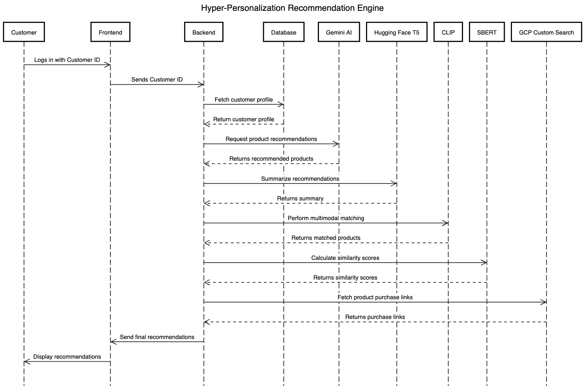
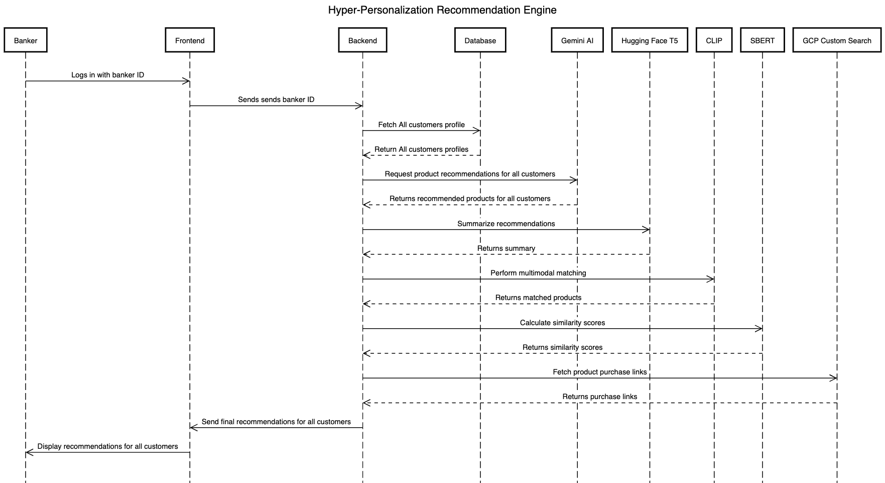

# 🚀 Project Name

## 📌 Table of Contents
- [Introduction](#introduction)
- [Demo](#demo)
- [Inspiration](#inspiration)
- [What It Does](#what-it-does)
- [How We Built It](#how-we-built-it)
- [Challenges We Faced](#challenges-we-faced)
- [How to Run](#how-to-run)
- [Tech Stack](#tech-stack)
- [Team](#team)

---

## 🎯 Introduction
A brief overview of your project and its purpose. Mention which problem statement are your attempting to solve. Keep it concise and engaging.

## 🎥 Demo
🔗 [Live Demo](#) 

(https://drive.google.com/file/d/1315-UXgavLlsbtkcpWQ7u5K9WoKTcPvi/view?usp=drive_link)

📹 [Video Demo](#) 

(https://drive.google.com/file/d/1315-UXgavLlsbtkcpWQ7u5K9WoKTcPvi/view?usp=drive_link)

📹 [Presentation](#) 


**Architecture:**
https://github.com/ewfx/aidhp-byte-brigade/blob/main/artifacts/arch/ByteBrigade-Architecture.png

## Sequence Diagram:
**Customer Flow**

**Banker Flow**

## 💡 Inspiration
The inspiration for this project came from the need to enhance customer experience and engagement in the banking sector by offering personalized product recommendations. Traditional banking product recommendations are often generic and lack personalization, leading to low conversion rates and customer dissatisfaction. We wanted to leverage AI and machine learning to create a smart, data-driven recommendation system that helps both customers and bankers make informed decisions.

Customers often struggle to find relevant financial products (loans, credit cards, investment plans, etc.) that align with their needs. Similarly, bankers lack an efficient way to identify and recommend the best products to their assigned customers. Our solution aims to:
	•	Personalize banking recommendations based on customer profiles, transactions, and interests.
	•	Assist bankers by providing an overview of the best-suited products for their customers.
	•	Use AI models to generate accurate, relevant, and explainable product suggestions.
	•	Enhance user experience by integrating multimodal AI and similarity analysis for better matching.

By solving this problem, we aim to bridge the gap between customers and financial products while improving conversion rates and customer satisfaction. 🚀

## ⚙️ What It Does
Our project is an AI-powered product recommendation system designed to enhance the banking experience for both customers and bankers. It analyzes customer data and leverages multiple AI models to generate personalized financial product recommendations.

**Key Features:**

**1.	Customer-Specific Recommendations**
 
		•	Customers receive personalized product suggestions (e.g., credit cards, loans, investment plans) based on their purchase history, interests, and engagement scores.
  
		•	Recommendations are fetched using Google Gemini AI and refined through multiple AI models for better accuracy.
  
**2.	AI-Driven Insights**
 
		•	Hugging Face T5 Model: Summarizes recommendations for easy understanding.
  
		•	CLIP (Multimodal Matching): Matches customer profiles with product images and descriptions.
  
		•	SBERT (Similarity Calculation): Measures similarity between user profiles and product embeddings to improve relevance.
  
		•	GCP Custom Search API: Retrieves real-time purchase links for recommended products.
  
**3.	Dual-Role Access: Customer & Banker Dashboards**
 
		•	Customers: View their top recommended products, along with explanations and purchase links.
  
		•	Bankers: Access a dashboard showing recommendations for all their assigned customers, helping them proactively suggest suitable financial products.
  
**4.	Seamless Backend Integration**
 
		•	Customer data is stored in customerdata.csv, which acts as our database.
  
		•	Backend processes customer ID, retrieves user profile, and interacts with AI models to generate and refine recommendations.
  
		•	Response is formatted and displayed in an intuitive user-friendly dashboard.
  

By combining machine learning, natural language processing, and multimodal AI, our project transforms the way banking products are recommended, ensuring a smarter, more engaging, and highly personalized experience for both customers and bankers. 
## 🛠️ How We Built It
Our project integrates multiple AI models, cloud services, and backend technologies to create a robust AI-powered product recommendation system. Here’s a breakdown of the key components and tools used in development:

**1. Backend & Data Processing**
	
**•	Python (FastAPI / Flask)** – Used to build the backend API for processing customer requests.
	
 •	Pandas  – For handling and processing the customer data stored in customerdata.csv.
	
 •	Google Gemini AI – Generates initial product recommendations based on user profiles.
	
 •	Hugging Face T5 Model – Summarizes product recommendations for better readability.
	
 •	CLIP (Contrastive Language-Image Pretraining) – Matches textual descriptions with product images for multimodal recommendations.
	
 •	SBERT (Sentence-BERT) – Calculates similarity between user profiles and product embeddings to refine recommendations.
	
 •	GCP Custom Search API – Fetches real-time purchase links for recommended products.

**2. Frontend & User Experience**
	
 •	React.js – Used for building the interactive frontend dashboard for both customers and bankers.
	
 •	Tailwind CSS – For styling and ensuring a clean UI/UX.
	
 •	Axios – For handling API calls between the frontend and backend.

**3. Cloud & Deployment**
	
 •	Google Cloud Platform (GCP) – Hosts APIs and handles custom search functionality.
	
 •	Hugging Face API – Used for text summarization and model inference.
	
 •	Docker – Containerized the backend for easy deployment.
	
 •	GitHub – Version control and collaborative development.

**4. Testing & Debugging**
	
 •	Postman – Used for API testing and validating response formats.


By combining AI, cloud, and web technologies, we built a system that provides highly personalized, data-driven product recommendations in real-time, enhancing the banking experience for both customers and relationship managers.

## 🚧 Challenges We Faced
During the development of our AI-powered product recommendation system, we encountered several technical and non-technical challenges. Here are the key obstacles we faced and how we tackled them:

**1. Data Handling & Retrieval**

	•	Challenge: Customer data was stored in a CSV file (customerdata.csv), making data retrieval less efficient compared to a structured database.
	•	Solution: We structured the backend to efficiently read and process data from the CSV file while ensuring minimal latency.

**2. Model Integration & Response Formatting**

	•	Challenge: Different AI models (Gemini, Hugging Face T5, CLIP, SBERT) returned responses in different formats, making it difficult to process them seamlessly.
	•	Solution: We adjusted our backend processing logic to handle responses dynamically and extract relevant insights.

**3. Multimodal Matching Complexity**

	•	Challenge: CLIP was used for text-to-image matching, but it required fine-tuning to ensure product images matched the textual recommendations correctly.
	•	Solution: We optimized prompt engineering and embedding similarity thresholds to improve matching accuracy.

**4. Ensuring Personalized & Relevant Recommendations**

	•	Challenge: Some recommendations were too generic, not fully aligning with user preferences.
	•	Solution: We fine-tuned SBERT similarity scores and applied context-aware filtering to improve relevance.

**5. Real-Time Product Purchase Link Retrieval**

	•	Challenge: GCP Custom Search API sometimes returned irrelevant purchase links.
	•	Solution: We fine-tuned the search queries and ranking logic to fetch the most relevant links.

Despite these challenges, our team successfully designed, optimized, and deployed a scalable AI-powered recommendation system that enhances customer engagement and helps bankers offer personalized financial guidance.

## 🏃 How to Run
### Backend (AI Engine)
1. Clone the Repository:
```
git clone <repository_url>
cd hyper-ai-recommendation
```
2. Install Dependencies:
```
pip install -r requirements.txt
```
3. Set up API Keys for OpenAI and Hugging Face.
4. Run the Application:
```
python app.py
```

### Frontend (React Application)
1. Prerequisites: Node.js, npm or yarn
2. Clone the Repository:

git clone <TBD>
3. Install Dependencies:

npm install

4. Run the Application:

npm start

5. Open [http://localhost:3000](http://localhost:3000)

## 🏗️ Tech Stack
- 🔹 Frontend: React
- 🔹 Backend: Python Flask API
- 🔹 Models: Gemini AI , Hugging Face T5  , CLIP , SBERT
- 🔹 Cloud: GCP Custom Search API

## 👥 Team
- **Bibhudatta Mishra** - [[GitHub](https://github.com/brownbraniac)](#) | [LinkedIn](#)
- **Abinash Prusty** - [GitHub](#) | [LinkedIn](#)
- **Zabir Akram** - [GitHub](#) | [LinkedIn](#)
- **Deepak Kumar Kar** - [GitHub](#) | [LinkedIn](#)
